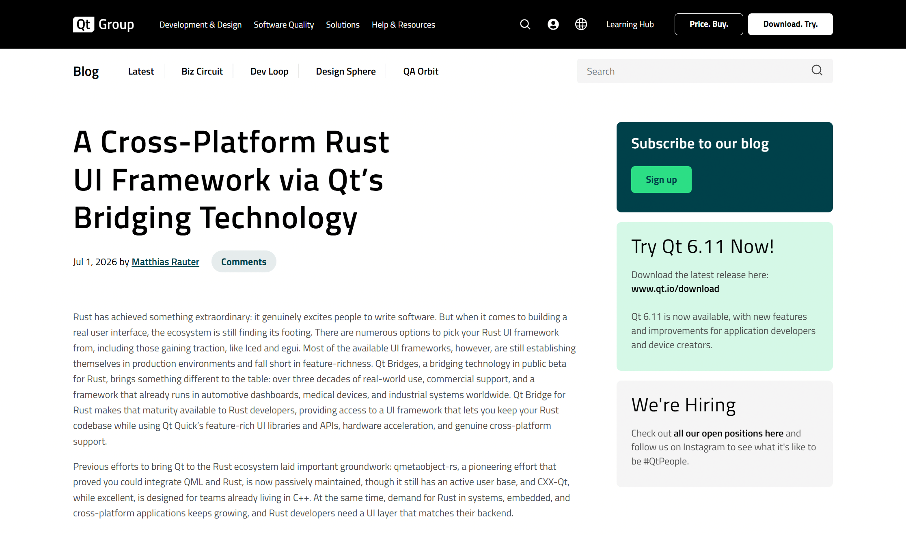
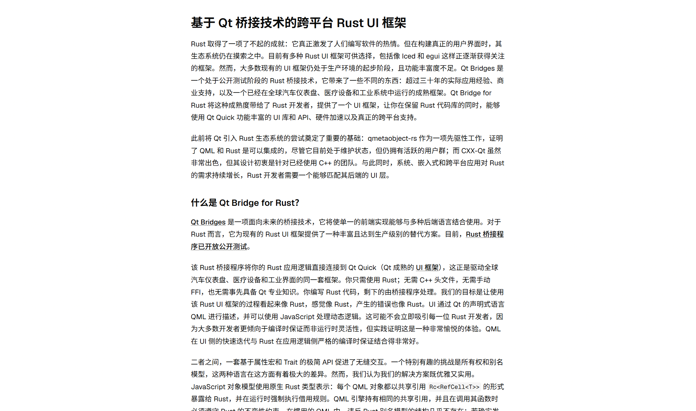

# delang

[English](./README.md) | 简体中文

delang 可以将任意文章 URL 转换为干净且经过翻译的阅读页面。

**Before**


**After**


---

## 使用方法

- `delang.domain/https://url`：直接阅读，享受 typeset 微调后的排版样式。
- `delang.domain/lang/https://url`：翻译为指定的 `lang`。
  - `lang` 会直接发送给大语言模型（LLM），因此你可以随意指定任何有趣的语言。
- `delang.domain/(lang)/https://news.ycombinator.com/item?id=...` 我们对 Hacker News 提供了特殊支持，它会整合原始文章、评论区的摘要以及评论的完整文本。
  - 检测机制（`worker/index.ts` 中的 `isHnItem`）会根据主机名 `news.ycombinator.com` + 路径 `/item` 进行判断，其他所有内容都使用常规的提取/翻译路径。
- 按下 `d` 键可切换浅色/深色模式。它也能自动检测你的系统主题。

## 工作原理

1. 使用 defuddle 获取 Markdown 内容。
2. 如果指定了语言，则使用 Gemini 进行翻译；默认使用 Gemini Flash Lite 模型。
3. 使用 [Streamup](https://github.com/OpticLM/streamup) 渲染 Markdown；样式由 shadcn/typeset 决定。你可以在[这里](https://ui.shadcn.com/typeset)进行调整和预览，然后修改代码库中的 typeset.css。

---

## 快速开始

```sh
pnpm install
# vite dev (Worker 通过 @cloudflare/vite-plugin 运行)
pnpm dev
```

创建你的本地密钥文件（已被 git 忽略）：

```sh
cp ".dev copy.example" .dev.vars   # 然后填入 GEMINI_API_KEY="..."
```

`.dev.vars` 保存了用于本地开发的 `GEMINI_API_KEY`。它已被 git 忽略（忽略 `.dev.vars*`，保留 `.dev.vars.example`）。

## 部署

delang 作为一个单一的 Worker 进行部署。已提交的 `wrangler.jsonc` 是共享的，且**不包含 `routes`**，因此 `pnpm deploy` 会推送到一个没有路由的 Worker（可通过其 `workers.dev` 子域名访问）。

### 首次设置

1. 复制示例文件并编辑路由为你的域名：

   ```sh
   cp wrangler.personal.jsonc.example wrangler.personal.jsonc
   # 编辑 wrangler.personal.jsonc：将 "routes" 下的 "pattern" 设置为你的域名
   ```

   `wrangler.personal.jsonc` 已被 git 忽略。

2. 设置生产环境变量（Secret）：

   ```sh
   wrangler secret put GEMINI_API_KEY
   # 粘贴来自 .dev.vars 的值
   ```

   验证是否已设置：`wrangler secret list`。

### 部署

```sh
# 构建并部署带有你自定义域名路由的 Worker
pnpm deploy:personal
```

### 身份验证

运行 `wrangler deploy` / `wrangler secret put` 需要 Cloudflare 身份验证。请执行以下操作之一：

- 在交互式终端中运行 `wrangler login`，**或者**
- 在环境变量中设置 `export CLOUDFLARE_API_TOKEN=<token>`。

### 各个部署路径的作用

- **`pnpm deploy`**（已提交的 `wrangler.jsonc`，无路由）：`@cloudflare/vite-plugin` 生成了 `.wrangler/deploy/config.json`，它会将 `wrangler deploy` **重定向**至预构建的 `dist/delang/wrangler.json`。你会在输出中看到 `Using redirected Wrangler configuration`。这适用于无路由的 / `workers.dev` 预览部署，也适合任何 Fork 该仓库的人。
- **`pnpm deploy:personal`**（`wrangler.personal.jsonc`，包含你的路由）：`--config` 会读取该文件，因此发送到 Cloudflare 的是你的 `routes` 字段，并且在部署时会绑定你的自定义域名。

如果你只想在不部署的情况下检查构建，空运行（dry-run）不需要身份验证：

```sh
pnpm exec wrangler deploy --dry-run
pnpm exec wrangler deploy --config wrangler.personal.jsonc --dry-run
```

## 致谢

- [Defuddle](https://github.com/kepano/defuddle)
- [Streamup](https://github.com/OpticLM/streamup)
- [shadcn/typeset](https://ui.shadcn.com/typeset)
- [Vite](https://vite.dev/)
- [Cloudflare](https://cloudflare.com)
- [LINUX DO](https://linux.do)