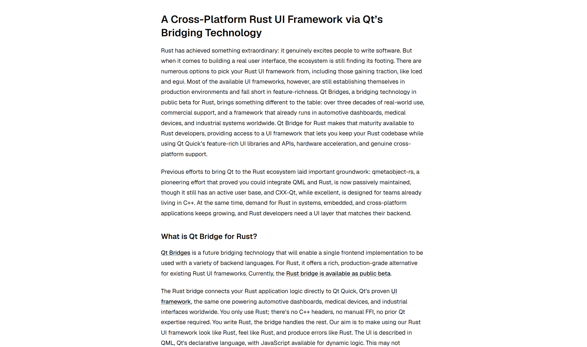

# delang

English | [简体中文](./README.cn.md)

delang turns any article URL into a clean, translated reading page.

**Before**


**After**


---

## How to use

- `delang.domain/https://url`: Just read, with typeset's fine-tuned style.
- `delang.domain/lang/https://url`: Translate to `lang`.
  - `lang` is directly sent to LLM so specify anything you like for fun.
- `delang.domain/(lang)/https://news.ycombinator.com/item?id=...` We offer special support for Hacker News, which aggregates the original article, a summary of the comments section, and the full text of the comments.
  - Detection (`isHnItem` in `worker/index.ts`) keys on hostname `news.ycombinator.com` + path `/item`; everything else uses the plain extract/translate path.
- Press `d` to toggle light/dark mode. It detects your system theme too.

## How does it work

1. Retrieve the Markdown using defuddle.
2. If a language is specified, translate it using Gemini; by default, the Gemini Flash Lite model is used.
3. Render the Markdown using [Streamup](https://github.com/OpticLM/streamup); the styling is determined by shadcn/typeset. You can adjust and preview it [here](https://ui.shadcn.com/typeset), then modify typeset.css in the codebase.

---

## Getting started

```sh
pnpm install
# vite dev (Worker runs via @cloudflare/vite-plugin)
pnpm dev
```

Create your local secrets file (gitignored):

```sh
cp ".dev copy.example" .dev.vars   # then fill in GEMINI_API_KEY="..."
```

`.dev.vars` holds `GEMINI_API_KEY` for local dev. It's gitignored (`.dev.vars*` is ignored, `.dev.vars.example` is kept).

## Deployment

delang deploys as a single Worker. The committed `wrangler.jsonc` is shared and contains **no `routes`**, so `pnpm deploy` pushes to a route-less Worker (reachable on its `workers.dev` subdomain).

### First-time setup

1. Copy the example and edit the route to your domain:

   ```sh
   cp wrangler.personal.jsonc.example wrangler.personal.jsonc
   # edit wrangler.personal.jsonc: set "pattern" under "routes" to your domain
   ```

   `wrangler.personal.jsonc` is gitignored.

2. Set the production secret:

   ```sh
   wrangler secret put GEMINI_API_KEY
   # paste the value from your .dev.vars
   ```

   Verify it's set: `wrangler secret list`.

### Deploy

```sh
# build + deploy Worker with your custom-domain route
pnpm deploy:personal
```

### Authentication

`wrangler deploy` / `wrangler secret put` need Cloudflare auth. Do one of:

- `wrangler login` in an interactive terminal, **or**
- `export CLOUDFLARE_API_TOKEN=<token>` in the environment.

### What each deploy path does

- **`pnpm deploy`** (committed `wrangler.jsonc`, no routes): `@cloudflare/vite-plugin` generated `.wrangler/deploy/config.json`, which **redirects** `wrangler deploy` to the pre-built `dist/delang/wrangler.json`. You'll see `Using redirected Wrangler configuration` in the output. Good for a route-less/`workers.dev` preview deploy and for anyone who forks the repo.
- **`pnpm deploy:personal`** (`wrangler.personal.jsonc`, your route): `--config` reads that file, so your `routes` field is what gets sent to Cloudflare and your custom domain is attached on deploy.

If you just want to check a build without deploying, dry-runs need no auth:

```sh
pnpm exec wrangler deploy --dry-run
pnpm exec wrangler deploy --config wrangler.personal.jsonc --dry-run
```

## Acknowledgement

- [Defuddle](https://github.com/kepano/defuddle)
- [Streamup](https://github.com/OpticLM/streamup)
- [shadcn/typeset](https://ui.shadcn.com/typeset)
- [Vite](https://vite.dev/)
- [Cloudflare](https://cloudflare.com)
- [LINUX DO](https://linux.do)